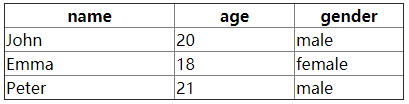

# vue-columns-resizable

<p>
  <a href="https://www.npmjs.com/package/vue-columns-resizable"></a>
  <a href="https://www.npmjs.com/package/vue-columns-resizable"></a>
  <a href="https://www.npmjs.com/package/vue-columns-resizable"></a>
</p>

Vue directive for making table columns resizable.

[demo](https://fuxy526.github.io/vue-columns-resizable/)



## Install

```sh
npm install vue-columns-resizable --save
```

## Usage

#### main.js

```javascript
import VueColumnsResizable from './plugins/vue-columns-resizable';

Vue.use(VueColumnsResizable);
```

#### *.vue

```html
<table border="1" class="table" v-columns-resizable>
  <thead>
    <tr>
      <th width="50%">name</th>
      <th width="25%">age</th>
      <th width="25%">gender</th>
    </tr>
  </thead>
  <tbody>
    <tr>
      <td>John</td>
      <td>20</td>
      <td>male</td>
    </tr>
    <tr>
      <td>Emma</td>
      <td>18</td>
      <td>female</td>
    </tr>
    <tr>
      <td>Peter</td>
      <td>21</td>
      <td>male</td>
    </tr>
  </tbody>
</table>
```

Resize on thead

```html
<table border="1" class="table">
  <thead v-columns-resizable>
    <tr>
      <th width="50%">name</th>
      <th width="25%">age</th>
      <th width="25%">gender</th>
    </tr>
  </thead>
  <tbody>
    <tr>
      <td>John</td>
      <td>20</td>
      <td>male</td>
    </tr>
    <tr>
      <td>Emma</td>
      <td>18</td>
      <td>female</td>
    </tr>
    <tr>
      <td>Peter</td>
      <td>21</td>
      <td>male</td>
    </tr>
  </tbody>
</table>
```

## Changelog

* 0.0.1 - Resize on columns & Resize on thead